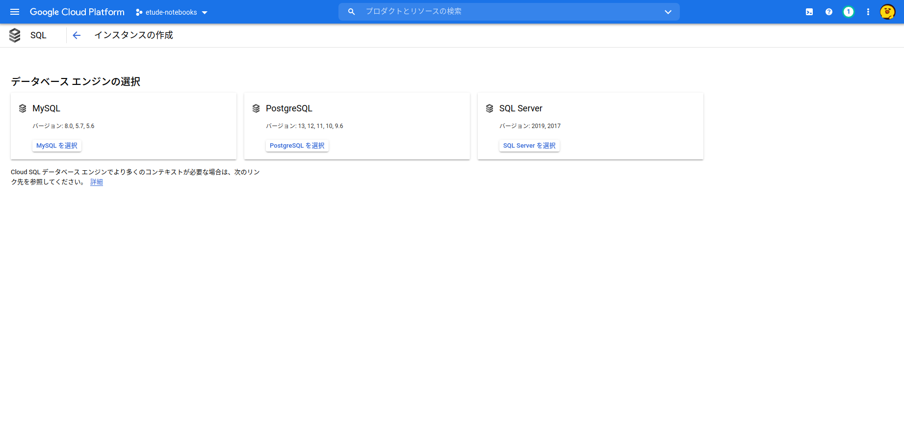
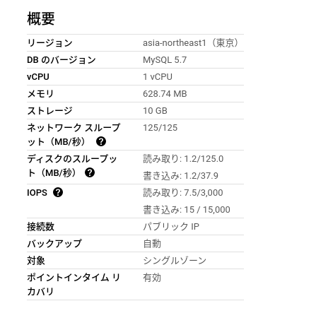

#GCP 

[Cloud SQL](https://cloud.google.com/sql/)は、[Google Cloud Platform](https://cloud.google.com/gcp/) インフラストラクチャでMySQL、PostgreSQL、SQL Server 向けのフルマネージド リレーショナル データベース サービスです。

普通データベース（以下、DB）を利用する際は、
専用のマシンまたは仮想マシンでデータベースサーバーを立ち上げる必要があります。[^1]
このセットアップ手順が中々にややこしいので、データベース作成は以外と大変です。

例えば、自分のPCまたはサーバー上で、`MySQL` を立ち上げようとしたら、
`ターミナル` (Mac) や`PowerShell` (Windows)などの`Shell`（黒い画面）を操作して作成する必要があります。
それはとても面倒です。

そして時代はクラウドです。
GoogleDriveやストレージのように、DBはクラウドにおいて管理するやり方が最近は主流になりつつあります。

GCPのCloud SQLはそのあたりの環境をGCP側に持ってもらおう、というものです。

# まずはじめにやること

GCPのアカウントを取得しましょう。
[基礎から学ぶGCP　第1回 〜GCPを使う準備をする〜](https://www.apps-gcp.com/gcp-basic-01-preparation/) が参考になります。

# Cloud SQL APIを有効にする

Cloud SQLへの接続方法は大きく3つあります。
1. Google Cloud Shellで接続
2. Cloud SQL Proxy経由で接続(TCP/IPソケット)
3. Google Cloud VPN内で接続(UTP)

# インスタンスを作成

## 1. MySQLを選択

## 2. インスタンスの設定

[^1]: DockerでDBを立ち上げる方法はこちら👉 [[MySQL]], [[PostgreSQL]], [[Local Dynamo DB]]