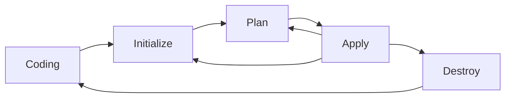

#TBD 

Terraformは、マルチクラウド上のコンピュータやネットワークの構築を自動化する、[[構成管理ツール]]の一つ。

Terraformを使って、インフラストラクチャや、ネットワーク、権限等をコードで表現することで、Gitによる変更点の管理や操作ミスの排除、コードレビューによるチェック体制の強化などが期待できる。

# 特徴

マネージドサービス、全般の構成に対して一括で管理可能。
各クラウドサービスが提供しているwebAPIで操作できる範囲での制御が可能。

## 対応クラウドサービス

- [[Amazon Web Servicces]]  
- Azure  
- [[Google Cloud Platform]]  
- Tencent Cloud
- Alibaba Cloud

cf. [2021年度最新版構成管理ツール(IaCツール)の比較](https://qiita.com/cocoa-maemae/items/8595246f444b1c08e479)

## 記述言語

HCL (HashiCorp Configuration Language) と呼ばれる独自の言語を使用して、インフラストラクチャを表現する。
デプロイ方法や配置の問題を、どの順番で展開していくか（手続き型）で表現するのではなく、理想的な決めて定義する手法で表現される（宣言型）。

## 機能

### Workflow

- **Coding**: コードに変更を加える作業を行う。
- **Initialize**: コードに記載された要件をダウンロードするために、コードを初期化する。
-  **Plan**: 変更点を確認し、単純に受け入れるかどうかを選択する。
-  **Apply**: 変更を受け入れ、実際のインフラストラクチャに対して適用する。
-  **Destroy**: 作成したインフラストラクチャをすべて破棄する。

# TFLint

`TSLint` を使用することで、インフラストラクチャ定義言語の構文エラー、規約エラー、クラウド上の制約に関する影響を静的解析することが可能となる。

- [tflintを利用したTerraformの静的解析](https://beyondjapan.com/blog/2021/05/terraform-tflint/)

## Reference

- [Google Cloud で Terraform を使用する](https://cloud.google.com/docs/terraform)