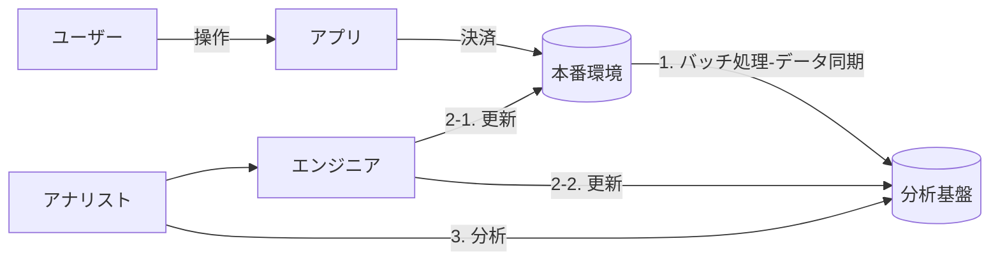

アナリストから、以下の要求が挙げられた。

> 現実の決済情報と、DB上の決済情報を日時レベルで整合させたい。
> エンジニアとどのようにコミュニケーションすれば、
> 条件は以下の通り。

- 決済データを使用して、データ分析を行いたい
- 取得基盤と、分析基盤のデータベースは異なっている
- ２つの基盤のデータ同期はバッチ処理により行われているため、
	分析基盤に反映されるまでにタイムラグが存在する
- 更新日時は、決済の更新があったタイミングと、バッチ処理の両方のタイミングで書き換わる

`本番環境の構造`

| キー名   | 書き換わるタイミング | 制約・概要       |
| -------- | -------------------- | ---------------- |
| 決済ID   | 書き換え不可                     | 主キー           |
| 作成日時 | 決済が開始された時                     |          |
| 更新日時 | ユーザーが決済情報が更新された時           | 初期値は作成日時 |

　　　　　　　　　　　　　⬇ バッチ処理により、日に一度データ同期が行われる

`分析基盤の構造`

| キー名   | 書き換わるタイミング   | 制約・概要 |
| -------- | ---------------------- | ---------- |
| 決済ID   |                        | 主キー     |
| 作成日時 | 決済が開始された時     |            |
| 更新日時 | バッチ処理が行われた時 |            |

## 困っていること

- 本番環境と、分析基盤のデータ同期が日時レベルで整合されていない
- データ同期のタイミングで、

## システムの問題点

## 解決策
